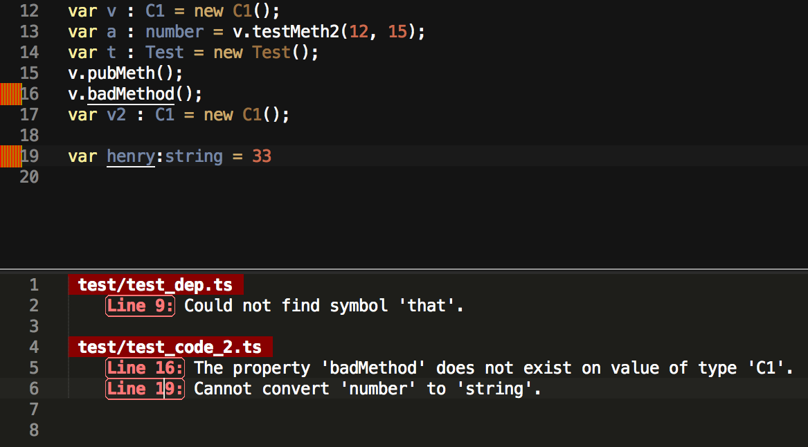

AngularJS + Typescript ♥♥
=========================

Follow Along:
-------------

[github.com/seanhess/angularjs-typescript][angularjs-typescript]

[video from ng-conf 2014](https://www.youtube.com/watch?v=u6TeBM_SC8w)

About Me
--------

Sean Hess

Code and Startups

- Twitter: [@seanhess][@seanhess]
- Blog: [seanhess.github.io](http://seanhess.github.io)
- Github: [github.com/seanhess](http://github.com/seanhess/)


WHY TYPESCRIPT?
==================================

Story of a Javascript App
-------------------------

- started fast with JS
- house of cards
- testing was hard

Typescript: be happy
--------------------

- like waking up on Christmas with well-written, fast tests
- formalize your choices as you go
- modern features make it easy: optional, inferred

see mistakes right away, in context



autocomplete


WHAT IS TYPESCRIPT?
==================

- basically compiles ES6 to JavaScript
- plus a modern type system

Getting Started
---------------

Install Typescript

    > npm install -g typescript

It is just JavaScript/ES6

    function hello(name) {
        alert("hello " + name)
    }
    hello("world")

Compile It
    
    > tsc test.ts

Add Types to Variables
----------------------

Try these in the Typescript Playground: [www.typescriptlang.org/Playground](http://www.typescriptlang.org/Playground/)

    var population:number = 3

    var name:string = "hello"
    var names:string[] = [name];

    var user:User;

    var couldBeAnything;

Produces output that looks the same

Interfaces
----------

Make some rules and keep them

    interface User {
        firstName: string;
        lastName: string;
    }

    // interface matches any object with the right fields
    var user:User = {firstName:"Very", lastName:"User"}
    var user2:User = {name:"Very User"} // error

    function fullName(user:User):string {
        return user.firstName + " " + user.lastName;
    }

Type Inference
--------------

The compiler can read your mind


    // name is a string
    var name = fullName(user)

    function sum(a:number, b:number) {
        return a + b
    }

    var result = sum(name, 4)

Generics
--------

Code for what things have in common

    function firstValue<T>(array:T[]):T {
        return array[0]
    }

    // these will give errors.
    var one:string = firstValue([1,2,3,4,5])
    var two:number = firstValue(["one", "two"])

ES6 Features
------------

External Modules: can output CommonJS or AMD

    // users.ts
    export function fullName(user:User):string {
        return user.firstName + " " + user.lastName
    }

    // main.ts
    import users = require("./users")
    var name = users.fullName(user)

Internal Modules

    module users {
        export function fullName(user:User):string {
            return user.firstName + " " + user.lastName
        }
    }

    var name = users.fullName(user)

Classes

    class Animal {
        public size:number;
        constructor() {
            this.size = 0;
        }
    }

    class Kitten extends Animal {
        public furriness:number

        devour(animal:Animal) {
            this.size += animal.size
        }

        get isCute() {
            return (this.size < 10 && this.furriness > 5)
        }
    }

Fat Arrow Functions

    var service = {
        names: [],

        loadNames: function() {
            $.get("/users", (users) => {

                // cheap inline functions
                var firstNames = users.map((user) => user.firstName)

                // "this" still works!
                this.names = firstNames
            })
        }
    }

Definition Files
----------------
 
External type definition files for many libraries on [DefinitelyTyped][dt]

    declare module ng {
        interface IScope {
            $parent:IScope;
            $eval(expressions:string):any;
            $watch(expressions:string):any;
            ... 
        }
    }

    function MyController(scope:ng.IScope) {}

IDE and Editor Integration
--------------------------

Error checking and Autocomplete:

- [Sublime Text 3 - T3S](https://github.com/Railk/T3S) - IDE-like
- [Sublime Text 3 - Build Errors](https://github.com/seanhess/sublime-build-errors) - Building, Errors
- Vim [[1]](https://github.com/clausreinke/typescript-tools) [[2]](https://github.com/leafgarland/typescript-vim)
- [WebStorm](http://blog.jetbrains.com/webstorm/2013/11/enjoy-typescript-in-webstorm/) - IDE
- [Visual Studio](http://www.microsoft.com/en-us/download/details.aspx?id=34790) - IDE


TYPESCRIPT + ANGULAR
====================

Add Typescript to TodoMVC AngularJS
-----------------------------------

Start with TodoMVC, let's add Typescript to it

[http://todomvc.com/architecture-examples/angularjs/](http://todomvc.com/architecture-examples/angularjs/)

Start with your Data Model
--------------------------

Make a file with shared application types: [`types.ts`][types.ts]. Data first design.

    interface Todo {
        completed: boolean;
        title: string;
    }

Add `:Todo` to function signatures

    function createTodo(text):Todo {
        return {
            title: text,
            completed: false
        }
    }

Add Definition Files
--------------------

- Get them from [DefinitelyTyped][dt]
- Add [`angular.d.ts`][angular.d.ts] and [`jquery.d.ts`][jquery.d.ts] to a types folder
- Add links to [`types.ts`][types.ts]

```
/// <reference path="./types/jquery/jquery.d.ts"/>
/// <reference path="./types/angularjs/angular.d.ts"/>
/// <reference path="./types/angularjs/angular-route.d.ts"/>

interface Todo {
    completed: boolean;
    title: string;
}
```

Angular Controller
------------------

Start with [`todoCtrl.js`][todoCtrl.js] 

    todomvc.controller('TodoCtrl', function TodoCtrl($scope, $routeParams, todoStorage, filterFilter) {
        var todos = $scope.todos = todoStorage.get();
        ...
    })

[`todoCtrl.ts`][todoCtrl.ts]: Add some interfaces for the scope and params

    interface TodoCtrlScope extends ng.IScope {
        todos:Todo[];
        newTodo:string;
        editedTodo:Todo;
        originalTodo:Todo;
        remainingCount:number;
        completedCount:number;
        allChecked:boolean;
        status:string;
        statusFilter:{completed:boolean};

        addTodo();
        editTodo(todo:Todo);
        doneEditing(todo:Todo);
        revertEditing(todo:Todo);
        removeTodo(todo:Todo);
        clearCompletedTodos(todo);
        markAll(completed:boolean);
    }

    interface TodoCtrlRouteParams {
        status:string;
    }

Add types to the parameters

    todomvc.controller('TodoCtrl', function TodoCtrl($scope:TodoCtrlScope, $routeParams:TodoCtrlRouteParams, todoStorage:TodoStorage, filterFilter) {
        var todos = $scope.todos = todoStorage.get();
        ...
    })

To use classes consider the [view model method](https://github.com/tastejs/todomvc/blob/gh-pages/labs/architecture-examples/typescript-angular/js/controllers/TodoCtrl.ts)

Angular Service
---------------

Start with [`todoStorage.js`][todoStorage.js]

```
todomvc.factory('todoStorage', function () {
    var STORAGE_ID = 'todos-angularjs';

    return {
        get: function () {
            return JSON.parse(localStorage.getItem(STORAGE_ID) || '[]');
        },

        put: function (todos) {
            localStorage.setItem(STORAGE_ID, JSON.stringify(todos));
        }
    };
});
```

To make [`todoStorage.ts`][todoStorage.ts], let's use a class

```
class TodoStorage {
    static STORAGE_ID = 'todos-angularjs';

    // dependencies would be injected here
    constructor() {

    }

    get():Todo[] {
        return JSON.parse(localStorage.getItem(TodoStorage.STORAGE_ID) || '[]');
    }

    put(todos:Todo[]) {
        localStorage.setItem(TodoStorage.STORAGE_ID, JSON.stringify(todos));
    }
}
```

for classes use `.service()` instead of `.factory()`

```
todomvc.service('todoStorage', TodoStorage)
```

Lets you formalize an API

Alternatively, you could just add an interface

Add a build step
----------------

Add a build step to your [Gruntfile.js][Gruntfile.js]

    grunt.initConfig({
        exec: {
            tsPublic: { cmd: 'node_modules/.bin/tsc public/js/app.ts public/js/**/*.ts -t ES5'},
        },

        watch: {
            public: {
                files: ["public/**/*.ts"],
                tasks: ["exec:tsPublic"],
                options: { livereload: true },
            },
        }
    })

    grunt.registerTask('default', ['exec:tsPublic', 'watch'])

Then just run `grunt`, and start saving files
    
    > grunt

No way to type views :(
-----------------------

    <!-- should be .title, but no error -->
    <label>{{todo.text}}</label>

Using ES6 Modules
-----------------

- simplest: just include all the generated .js files
- add a build script: `grunt concat`
- namespaces? use internal modules
- with browserify or AMD: use external modules

Live Code: Refactoring a Service
--------------------------------

- Let's add promises! What could go wrong?
- Typescript will save us!

What about Dart? Coffeescript?
------------------------------

- There can be only one
- was worth giving up [Coffeescript](http://coffeescript.org/)
- Dart has a cool type system, but it is all-in.

Other cool things you could try:
--------------------------------

- Rich models with classes

IT'S OVER!
==========

[github.com/seanhess/angularjs-typescript][angularjs-typescript]

Concat Me: [@seanhess][@seanhess]

[dt]: https://github.com/borisyankov/DefinitelyTyped
[typescript]: http://www.typescriptlang.org/
[angular]: http://angularjs.org/
[types.ts]: public/js/types.ts
[angular.d.ts]: public/js/types/angularjs/angular.d.ts
[jquery.d.ts]: public/js/types/jquery/jquery.d.ts

[todoStorage.js]: http://github.com/seanhess/angularjs-typescript/blob/js/public/js/services/todoStorage.js
[todoStorage.ts]: public/js/services/todoStorage.ts

[todoCtrl.js]: http://github.com/seanhess/angularjs-typescript/blob/js/public/js/controllers/todoCtrl.js
[todoCtrl.ts]: public/js/controllers/todoCtrl.ts

[Gruntfile.js]: Gruntfile.js

[angularjs-typescript]: http://github.com/seanhess/angularjs-typescript
[@seanhess]: http://twitter.com/seanhess


TODO: paste in images of IDEs


